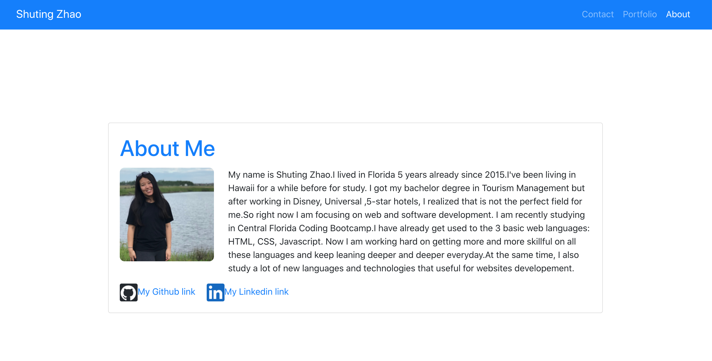

# **shuting_react_portfolio**

       
      
  App: https://github.com/zst199394/My_calendar_scheduler_web

  ## Description

  Create a updated portfolio using React and other materials to build toward being employer competitive since I worked with React and have multiple projects to share.
  Git-hub page link : ?
  

  ## Table of contents
  - [Description](#Description)
  - [Usage](#Usage)
  - [License](#License)
  - [Contributing](#Contributing)
  - [Test](#Test)
  - [Repository Link](#Repository)
  - [GitHub Info](#GitHub) 

  ## Usage

  Creating a portfolio using React will help set you apart from other developers whose portfolios do not use some of the latest technologies.
  As with the previous portfolio homework, "good" design is subjective.My site should look "polished." Here are a few guidelines on what that means:
* Mobile-first design

* Choose a color palette for your site so it doesn't just look like the default bootstrap theme or an unstyled HTML site.

* Make sure the font size is large enough to read, and that the colors don't cause eye strain.

* Using animations and react component libraries. 

  ## Licence
  
  
  ## Contributing
  
    
       Developer : Shuting Zhao

  ## GitHub
  My Github Username : zst199394
  - [GitHub Profile](http://github.com/zst199394)

  
  ## Reach Me 
  My email : zst9394@outlook.com
  - [Email address](zst9394@outlook.com)
